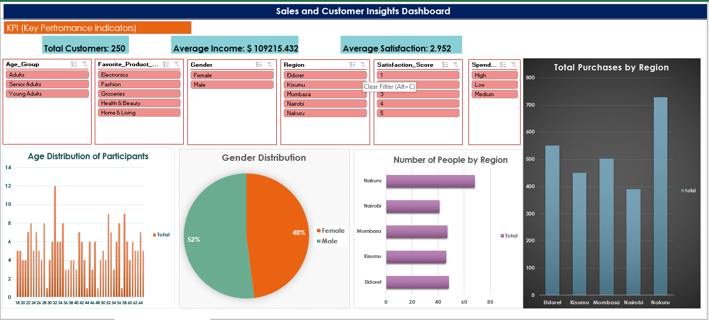

# 📊 Sales Dashboard in Excel

This is my first complete Excel Dashboard project.  
It includes KPIs, charts, and slicers for analyzing sales performance.

## Features
- KPIs: Total Customers, Average Income, Average Customer Satisfaction
- Charts: Trends, Customer Insights, Product Analysis
- Interactive slicers for filtering data

## Files
- `SALES_DASHBOARD.xlsx` → Editable Excel file
- `customer_dataset.pdf` → Used dataset in csv format

## Preview
Here’s a screenshot of the dashboard:

